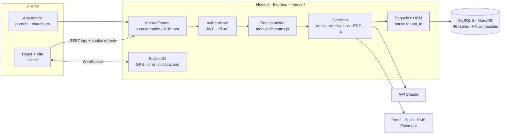
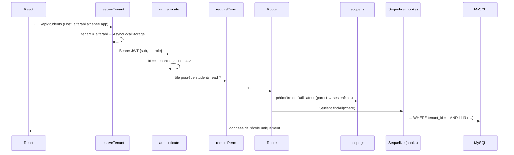
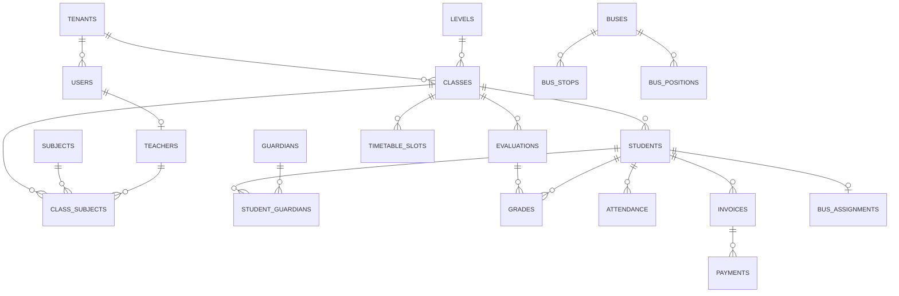

# Athénée School OS — Architecture MERN avec MySQL

> **Stack** : **M**ySQL (à la place de MongoDB) · **E**xpress · **R**eact · **N**ode.js
> Les données d'une école sont fortement relationnelles (élèves ↔ classes ↔ notes ↔ factures) et exigent des transactions et une intégrité stricte. MySQL (ou MariaDB) est donc plus adapté que MongoDB. Le reste de la stack MERN est inchangé.

## 1. Vue d'ensemble



## 2. Arborescence

```
Ecoles privées/
├── server/                         API Express (Node.js)
│   ├── database/schema.sql         Schéma MySQL (source de vérité, 48 tables)
│   ├── scripts/
│   │   ├── db-init.js              Crée la base et applique le schéma
│   │   ├── seed.js                 2 écoles de démonstration
│   │   └── smoke-test.js           39 tests de bout en bout
│   └── src/
│       ├── server.js               HTTP + Socket.IO
│       ├── app.js                  Middlewares et montage des routes
│       ├── config/                 env.js · database.js · permissions.js (RBAC)
│       ├── core/                   context.js (AsyncLocalStorage) · crud.js · errors.js
│       ├── middlewares/            tenant.js · auth.js · common.js (validation, audit, erreurs)
│       ├── models/                 index.js (Sequelize) · tenantScope.js (isolation)
│       ├── services/               scope · grading · notifier · realtime · security · pdf · ai
│       └── modules/                auth · school · pedagogy · life · admin (*.routes.js)
├── client/                         React 18 + Vite + React Router + Recharts
│   └── src/
│       ├── api/client.js           Axios : jeton en mémoire, refresh automatique
│       ├── context/AuthContext.jsx Session, permissions, socket temps réel
│       ├── layouts/AppLayout.jsx   Sidebar filtrée par permissions
│       ├── components/             ui.jsx (design system), AiAssistant.jsx
│       └── pages/                  25 écrans (tableau de bord, élèves, notes…)
└── index.html / app.html           Prototype statique et landing page
```

## 3. Cycle d'une requête



## 4. Isolation multi-tenant (MySQL n'a pas de Row-Level Security)

La protection est construite en **4 couches indépendantes**. Chacune suffit à empêcher une fuite si une autre est contournée :

| Couche | Où | Mécanisme |
|---|---|---|
| 1. Résolution | `middlewares/tenant.js` | Le tenant vient du domaine (ou de `X-Tenant` en dev), jamais du corps de la requête. |
| 2. Jeton | `middlewares/auth.js` | Le JWT contient `tid` : un jeton de l'école A est refusé sur l'école B (403). |
| 3. ORM | `models/tenantScope.js` | Hooks Sequelize sur **chaque** modèle : `WHERE tenant_id = ?` sur les lectures, les includes, les counts, les updates et les deletes. `tenant_id` est imposé à la création. **Hors contexte, toute requête est refusée (fail-closed).** |
| 4. Base | `database/schema.sql` | **Clés étrangères composites** `(tenant_id, x_id) → parent(tenant_id, id)` : MySQL refuse physiquement qu'un élève de l'école A pointe vers une classe de l'école B. |

À l'intérieur d'une école, `services/scope.js` limite la visibilité : un enseignant voit ses classes, un parent ses enfants, un élève lui-même.

Les 4 couches sont vérifiées par `npm run smoke`.

## 5. Sécurité

- **Authentification** : bcrypt, JWT d'accès de 15 minutes gardé en mémoire (et non dans localStorage), refresh token opaque dans un **cookie httpOnly** (haché en SHA-256 en base) avec **rotation** à chaque usage, révocation par session.
- **2FA TOTP** (Google Authenticator, Authy), **verrouillage** après 5 échecs, rate-limit sur `/login`.
- **RBAC** : `config/permissions.js`, avec 8 rôles et des permissions `ressource:action`.
- **Chiffrement applicatif AES-256-GCM** des données de santé (`health_records`, `infirmary_visits`). Chaque consultation est **auditée**.
- **Journal d'audit** : toutes les écritures (méthode, route, utilisateur, IP, statut).
- **Validation** zod de toutes les entrées ; Helmet ; CORS restreint ; erreurs SQL traduites (409 / 400) sans fuite d'information.
- **Plans SaaS** : `requireFeature('transport')` renvoie 402 si le module n'est pas inclus dans l'abonnement.

## 6. Modèle de données (extrait)



Les 48 tables sont regroupées ainsi :

| Domaine | Tables |
|---|---|
| Plateforme | plans, tenants |
| Identité | users, sessions, audit_logs, notifications |
| Structure | levels, subjects, rooms, teachers, classes, class_subjects |
| Personnes | students, guardians, student_guardians |
| Pédagogie | timetable_slots, timetable_exceptions, attendance, evaluations, grades, homework, homework_submissions |
| E-learning | courses, course_lessons, lesson_progress, library_items |
| Transport | buses, bus_stops, bus_assignments, bus_positions, bus_boardings |
| Vie scolaire | canteen_menus, activities, activity_enrollments, health_records, infirmary_visits, lost_items, documents, enrollment_applications |
| Finance | invoices, payments |
| Communication | conversations, conversation_members, messages, announcements, events, tickets, ticket_messages |

Les contraintes métier sont portées par MySQL lui-même :
- `UNIQUE (tenant_id, teacher_id, weekday, start_time)` empêche un enseignant d'avoir deux cours en même temps (le drag & drop renvoie alors 409) ;
- `UNIQUE (tenant_id, student_id, on_date, period)` impose un seul appel par élève et par demi-journée ;
- des `CHECK` sur les montants et les JSON ;
- des index `FULLTEXT` pour la correspondance des objets perdus et trouvés.

## 7. API REST (préfixe `/api`, en-tête `X-Tenant` en dev)

| Domaine | Endpoints principaux |
|---|---|
| Auth | `POST /auth/login` · `POST /auth/refresh` · `POST /auth/logout` · `GET /auth/me` · `POST /auth/2fa/setup` · `POST /auth/2fa/enable` · `GET/DELETE /auth/sessions` |
| Structure | `GET/POST /levels` `/subjects` `/rooms` `/users` · `GET/POST/PATCH /teachers` · `GET /classes` · `GET /classes/:id` · `PUT /classes/:id/subjects` |
| Élèves | `GET /students?q&classId&cycle` · `GET /students/:id` (fiche 360°) · `POST/PATCH/DELETE /students` · `GET/POST /guardians` |
| Emploi du temps | `GET /timetable?classId|teacherId|roomId` · `PATCH /timetable/:id/move` · `POST /timetable/:id/exceptions` |
| Présences | `GET /attendance` · `POST /attendance/roll` · `PATCH /attendance/:id/justify` |
| Notes | `GET/POST /evaluations` · `GET/PUT /evaluations/:id/grades` · `GET /classes/:id/averages` · `GET /students/:id/averages` · `GET /students/:id/report-card.pdf` |
| Devoirs | `GET/POST /homework` · `POST /homework/:id/submit` · `PATCH /homework/submissions/:id` |
| E-learning | `GET/POST /courses` · `GET /courses/:id` · `POST /courses/:id/lessons` · `POST /courses/lessons/:id/complete` · CRUD `/library` |
| Transport | `GET /transport/buses` · `POST /transport/buses/:id/position` · `POST /transport/boardings` · `PATCH /transport/buses/:id` |
| Vie scolaire | `/canteen/menus` · `/activities` (+ `/:id/enroll`) · `/health/visits` · `/health/records/:id` · `/lost` (+ `/:id/matches`) · `/documents/certificate/:id` |
| Inscriptions | `POST /public/enrollments` (sans compte) · `GET /enrollments` · `PATCH /enrollments/:id/status` |
| Finance | `GET /finance/invoices` · `GET /finance/stats` · `POST /finance/invoices/:id/pay` · `POST /finance/reminders` · `GET /finance/invoices/:id/receipt.pdf` |
| Échanges | `/conversations` (+ messages) · `/announcements` · `/events` · `/tickets` (+ messages, statut) · `/notifications` |
| Pilotage | `GET /dashboard` (selon le rôle) · `GET /analytics/overview` · `GET/PATCH /settings` · `GET /audit` · `POST /ai/chat` |

Événements Socket.IO :
- côté client, `bus:follow`, `bus:unfollow` et `conv:join` ;
- côté serveur, `notification`, `bus:position` et `message`.

Les salons sont préfixés par le tenant.

## 8. Flux temps réel et notifications

- **Absence** : `POST /attendance/roll` enregistre l'appel en transaction, puis `notifier.notify()` insère une ligne dans `notifications`, émet `notification` sur Socket.IO, et envoie un push et un SMS aux parents.
- **Bus** : le boîtier GPS ou l'application de l'accompagnateur appelle `POST /buses/:id/position`, qui enregistre la position, calcule l'ETA (haversine) et diffuse `bus:position`. Si le bus est à moins de 1,5 km d'un arrêt, les parents de cet arrêt reçoivent « Le bus arrive ».
- **Montée / descente** : un scan QR, RFID ou NFC déclenche `POST /boardings`, qui notifie le parent (« X est monté(e) dans le bus »).
- Les canaux email, push et SMS sont des adaptateurs dans `services/notifier.js`, à brancher sur un fournisseur (SES, FCM, fournisseur SMS local).

## 9. Assistant IA

`POST /api/ai/chat` appelle Claude **côté serveur uniquement** (`@anthropic-ai/sdk`, modèle `claude-opus-5`, configurable par `AI_MODEL`) :
- il utilise la réflexion adaptative avec l'effort réglé sur `low` ;
- il active le **repli automatique** de l'API (`fallbacks: "default"`) si le modèle décline une requête.

Le contexte envoyé au modèle ne contient que des données **déjà filtrées par école et par rôle**, et jamais de données de santé. Sans `ANTHROPIC_API_KEY`, un moteur local répond à la place.

## 10. Déploiement en production

- **Base** : MySQL 8 managé (AWS RDS, OVH, Azure) avec sauvegardes automatiques, PITR, chiffrement au repos et réplica de lecture pour l'analytics.
- **API** : plusieurs instances Node derrière un load balancer (PM2 ou conteneurs).
  - Socket.IO multi-instances passe par `@socket.io/redis-adapter`.
  - Le rate-limit passe par un store Redis.
- **Client** : `npm run build` produit des fichiers statiques à servir via CDN ou Nginx, avec `/api` et `/socket.io` en reverse proxy.
- **Domaines** : wildcard `*.athenee.app` avec certificat wildcard ; domaines personnalisés en CNAME et TLS automatique.
- **Variables obligatoires en production** : `JWT_*_SECRET`, `DATA_ENCRYPTION_KEY` et `ALLOW_TENANT_HEADER=false`. Le serveur refuse de démarrer sinon.
- **Fichiers** (devoirs, justificatifs) : stockage objet S3-compatible, clés préfixées par le tenant, URLs signées.
- **Migrations** : versionner les évolutions du schéma (`database/migrations/NNN_*.sql`) et les appliquer en CI.

## 11. Services externes (fichiers, envois, paiement)

- **Fichiers** (`modules/files.routes.js`, `services/storage.js`) :
  - clés préfixées par l'école ;
  - liste blanche de types, avec vérification de la signature binaire ;
  - taille maximale configurable ;
  - lecture autorisée selon le type : un justificatif médical n'est lisible que par son auteur, la vie scolaire et l'infirmerie ;
  - un fichier n'est rattaché à un enregistrement que s'il appartient à l'utilisateur (`claimFile`).
- **Envois** (`services/channels.js`, `services/notifier.js`) :
  - email SMTP (ou fichiers `.eml` en dev), SMS Twilio ou fournisseur HTTP, Web Push (VAPID) ;
  - envoyés en arrière-plan, selon les préférences de chaque utilisateur ;
  - tracés dans `notification_deliveries`.
- **Paiement** (`services/payments.js`) : Stripe Checkout.
  - L'encaissement n'est confirmé **que** par le webhook signé.
  - L'enregistrement est idempotent (verrou de ligne + statut), donc un événement rejoué ne crée pas de double paiement.
  - Un mode simulé existe en développement.
  - Un adaptateur CMI suivrait la même interface.
- **Import Excel** (`services/studentImport.js`) :
  - modèle `.xlsx` avec les classes en liste déroulante ;
  - aperçu ligne par ligne des erreurs, puis création en une transaction ;
  - parents dédoublonnés par téléphone ou email.
- **Migrations** : `database/migrations/NNN_*.sql`, appliquées une seule fois (table `schema_migrations`).

## 12. Ajouter un module

1. Ajouter la table dans `schema.sql`, avec `tenant_id`, `UNIQUE (tenant_id, id)` et des FK composites.
2. Déclarer le modèle avec `tenantModel()` dans `models/index.js`. L'isolation est alors automatique.
3. Créer les routes avec `crudRouter({ model, resource, createSchema })` ou des routes sur mesure.
4. Ajouter les permissions `ressource:action` aux rôles dans `config/permissions.js`.
5. Ajouter la page React et son entrée dans `NAV` (`client/src/App.jsx`).
6. Ajouter un cas dans `scripts/smoke-test.js`.
